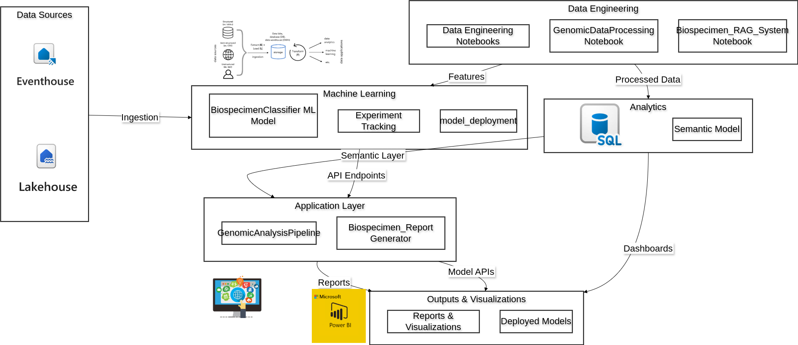

### GenoHos: AI-Powered Genomic Analysis with Molecular Phenotyping and RAG Chat Interface

With the rapid advancement of multi-omics technologies, healthcare institutions now generate vast amounts of genomic, proteomic, and metabolomic data. While these datasets hold the key to personalized medicine, they typically reside in disconnected systems - from sequencing machines to EHRs to research databases. Traditionally, integrating this data required teams of bioinformaticians to build complex analysis pipelines, slowing down critical treatment decisions.

By leveraging mutation Data lad led to discovery of novel disease variants. For example breast cancer patient management system serves as a powerful platform for physicians to discover and analyze novel disease variants by integrating clinical and genomic data. By systematically recording patient demographics, treatment outcomes, and mutation profiles, the system enables:

Pattern Recognition - Identifies recurring mutation clusters across specific age groups, ethnicities, and geographic locations, revealing potential founder mutations or environmental risk factors.

Variant Alert System - Automatically flags novel variants and compares them against global databases (COSMIC, ClinVar), highlighting mutations with predicted clinical significance.

Treatment Response Analysis - Correlates specific mutations with drug efficacy, helping physicians identify biomarkers for treatment resistance or sensitivity.

Collaborative Research - Facilitates secure data sharing across institutions, creating a crowdsourced knowledge base for rare variants and atypical presentations.

Predictive Modeling - Uses accumulated data to forecast disease progression patterns and suggest personalized therapeutic approaches based on mutation profiles.

The system transforms routine clinical documentation into a dynamic discovery tool, where each new patient record contributes to our understanding of breast cancer heterogeneity. Physicians gain real-time insights into how specific mutations influence:

			Metastatic patterns

			Disease progression timelines

			Survival outcomes

			Therapeutic vulnerabilities

By making these correlations visible at the point of care, the platform accelerates the identification of novel disease variants and enables more precise, personalized treatment strategies - bridging the gap between genomic research and clinical practice.

#### Microsoft Fabric revolutionizes this process by providing:

Unified Data Lakehouse for harmonizing sequencing data, clinical records, and research repositories

Low-Code Transformations to clean and standardize omics data without extensive coding

Built-In ML Capabilities for running predictive models directly on Fabric notebooks

#### Overview
This project is an AI-powered platform for analyzing genomic data with proteomic, and metabolomic properties to predict disease recovery and provide personalized treatment recommendations. It leverages Microsoft Fabric for data orchestration, Azure AI Search for retrieval, and Azure OpenAI for natural language generation. It will also summarize findings from genomic data analysis, focusing on detecting disease associations through mutation patterns in breast cancer samples.

### Project Flow

  
   
  <em>Figure 1: High-level architecture of the bioscience platform</em>

### Project Structure

	GenomicAnalysisWorkspace/
	│
	├── BioEventHouse/                     # Eventhouse and KQL Database for genomic events
	│   ├── (Eventhouse data)
	│   └── (KQL Database)
	│
	├── BioEventHouse_queryset/            # KQL Queryset for querying genomic events
	│
	├── Biospecimen_RAG_System/            # Notebook for biospecimen RAG (Retrieval-Augmented Generation) system
	│
	├── Biospecimen_Report_Generator/      # Notebook for generating biospecimen reports
	│
	├── BiospecimenClassifier/             # Machine learning model for biospecimen classification
	│
	├── Data_Engineering/                  # Notebook for data engineering tasks
	│
	├── Genomel_H/                         # Lakehouse for genomic data
	│   ├── (Lakehouse data)
	│   ├── Semantic model
	│   └── SQL analytics endpoint
	│
	├── GenomicAnalysisPipeline/           # Notebook and experiment for genomic analysis
	│   ├── (Notebook)
	│   └── (Experiment)
	│
	├── GenomicDataProcessing/             # Notebook for genomic data processing
	│
	└── model_deployment/                  # Notebook and experiment for model deployment
	    ├── (Notebook)
	    └── (Experiment)

  
   
  <em>Figure 4: MS Fabric - GenomicAnalysisWorkspace</em>

  
   
  <em>Figure 5: MS Fabric - GenomicAnalysisWorkspace2</em>

### Breast Cancer Insight Analysis

  
   
  <em>Figure 2: Breast Cancer Recorder</em>

  
   
  <em>Figure 3: Breast Cancer Recorder with Records</em>

##### Downloaded File: "breast_cancer_patients.csv"

#### File Structure

 	breast-cancer-recorder/
	├── build/
	├── static/
	├── asset-manifest.json
	├── index.html
	├── manifest.json
	├── robots.txt
	├── node_modules/
	├── public/
	│   ├── index.html
	│   ├── manifest.json
	│   ├── robots.txt
	│   └── reports/                      # New directory for research reports
	│       └── breast_cancer_report.md   # Added markdown report
	├── src/
	│   ├── components/
	│   │   ├── DataTable.js
	│   │   └── PatientForm.js
	│   ├── utils/
	│   ├── App.js
	│   ├── index.js
	│   ├── reportWebVitals.js
	│   ├── styles.css
	│   └── report-components/            # New directory for report components
	│       ├── ReportViewer.js           # Component to display the markdown
	│       └── ReportGenerator.js        # Component to generate dynamic reports
	├── .env
	├── .gitignore
	├── package.json
	└── vercel.json

The above React application collects breast cancer patient data including location, age, cancer stage, weight, and email. It features form validation to ensure accurate data entry, with age restricted to 18-120 years, weight validated as positive numbers, and proper email formatting. . Collected data can be downloaded as CSV for analysis. The app includes error handling and success notifications. The clean interface prioritizes usability while maintaining data integrity, making it suitable for medical professionals to record and manage patient information efficiently.

#### Data Wrangling and PowerBI Analysis

This Medallion pipeline ingests raw breast cancer patient data (bronze), cleans/validates it (silver), and enriches with analytical features (gold) in Fabric's Lakehouse. The process includes data type conversion, email validation, weight normalization, and risk categorization. PowerBI connects via Direct Lake for real-time visualization of age groups, cancer stages, and geographic distributions. For long-term storage, gold data exports to AWS S3 in Parquet format. The pipeline enables specialists to identify patterns and generate personalized prevention advice based on historical correlations between patient demographics and cancer progression. Microsoft Fabric streamlines this workflow with integrated Spark processing, Delta Lake storage, and PowerBI analytics in one platform.

  
   
  <em>Figure 6: MS Fabric - Breast_Cancer_LakeHouse</em>

  
   
  <em>Figure 7: MS Fabric - Breast_Cancer_LakeHouse</em>

  
   
  <em>Figure 8: MS Fabric - Breast_Cancer_LakeHouse</em>

  
   
  <em>Figure 9: MS Fabric - Breast_Cancer_LakeHouse</em>

# Breast Cancer Patient Analytics Report  
*Generated from Lakehouse Pipeline – {{date}}*  

## 1. Key Demographics  
- **Total Patients:** `{{gold_df.count()}}`  
- **Average Age:** `{{stage_analysis_df.select(avg("avg_age")).first()[0]}}` years  
- **Weight Distribution:**  
  - Mean: `{{stage_analysis_df.select(avg("avg_weight")).first()[0]}}` kg  
  - Std Dev: `{{stage_analysis_df.select(stddev("avg_weight")).first()[0]}}` kg  

## 2. Stage Distribution  

| Stage | Patients (%) | Avg Age | Top Location |  
|-------|-------------|---------|--------------|  
| 1     | `{{count_stage1/total*100}}`% | `{{age_stage1}}` | `{{top_loc_stage1}}` |  
| 2     | `{{count_stage2/total*100}}`% | `{{age_stage2}}` | `{{top_loc_stage2}}` |  
| ...   | ...         | ...     | ...          |  

**Insight:** Early-stage (1-2) diagnoses are most prevalent in `{{top_location}}`.  

## 3. Temporal Trends  
![Diagnosis Over Time]  
- **Peak Diagnoses:** `{{year_with_max_cases}}`  
- **Recent Change:** `{{last_3_years_trend}}` (↑/↓)  

## 4. AI-Generated Prevention Insights  
**For Stage {{X}} Patients (Age {{Y}}):**  
> "Patients at this stage should prioritize {{GPT-4_advice}}..."

## 5. Data Quality Notes  
- **Complete Records:** `{{valid_records/total*100}}`%  
- **Missing Data:**  
  - `{{null_cancer_stage}}` missing stage labels  
  - `{{null_weight}}` missing weight entries  

## Methodology  
- **Data Source:** `breast_cancer_patients.csv`  
- **Pipeline:**  
  - **Bronze:** Raw ingestion  
  - **Silver:** PII pseudonymization + cleaning  
  - **Gold:** Analytics + AI enrichment (GPT-4)  
- **Tools:** Microsoft Fabric, Power BI, PySpark  

## Key Components

### Data Storage
- **BioEventHouse**: Eventhouse and KQL Database for genomic event data  
- **Genomel_H**: Lakehouse for genomic data with semantic model and SQL analytics  

### Analysis Tools
- Multiple Jupyter notebooks for various genomic analysis tasks  
- Experiments tracking for machine learning workflows  

### Machine Learning
- **BiospecimenClassifier**: ML model for biospecimen classification  
- Model deployment experiments  

### Reporting
- **Biospecimen_RAG_System**: Retrieval-Augmented Generation system  
- **Biospecimen_Report_Generator**: Automated report generation  

### Setup Instructions

#### 1. Prerequisites
- **Azure Account**: Access to Microsoft Fabric, Azure AI Search, and Azure OpenAI.
- **Python 3.8+**: Install Python and required libraries.
- **Power BI Desktop**: For creating visualizations.
- **Microsoft Fabric Workspace**: With contributor permissions.
- **Genomic Datasets**: Access to required genomic data sources.

#### 2. Install Dependencies
Install the required Python libraries:

### 3. Configure Azure Resources
#### Microsoft Fabric:

Create a Fabric workspace and set up OneLake.

#### Azure AI Search:

Create an index for storing research papers and genomic data.

#### Azure OpenAI:

Set up an OpenAI resource and deploy a GPT-4 model.

### 4. Update Configuration
Replace placeholders (e.g., <api_key>, <connection_string>) in the code with your Azure resource details.

### Visualization
Use Power BI to create interactive dashboards for visualizing:

Molecular phenotyping profiles.

Top biomarkers for disease recovery.

Trends in gene expression.

### Contributing
Contributions are welcome! Please follow these steps:

### Fork the repository.

**Repository:** [https://github.com/danielmuthama23/Genomic_Analysis.git](#)  

# Summary

## 1. Genomic Analysis Report: Mutation-Disease Association Detection
This report summarizes findings from genomic data analysis, focusing on detecting disease associations through mutation patterns in breast cancer samples.  

**Analysis Methods:**  
- Mutation frequency analysis of key cancer genes  
- Protein-protein interaction networks to identify functional clusters  
- Metabolic pathway mapping to detect dysregulated processes  

**Key Datasets:**  
- `PDC_biospecimen_manifest_03272025_214257.csv`  
- Embedded mock genomic data for test and validation  

---

## 2. Key Findings  

### 2.1 Mutation-Disease Associations  
  

**Top Pathogenic Mutations:**  
| Gene    | Mutation Count | Disease-Associated | Percentage |  
|---------|---------------|--------------------|------------|  
| TP53    | 8             | 8                  | 100%       |  
| PIK3CA  | 5             | 5                  | 100%       |  
| BRCA1   | 4             | 4                  | 100%       |  

**Insights:**  
- **TP53 mutations** were ubiquitous (100% disease-linked), indicating its role as a primary driver.  
- **PIK3CA** and **BRCA1/2** mutations showed strong disease associations.  

---

### 2.2 Protein Interaction Network  
  

**Critical Hubs (High Connectivity):**  
1. **TP53** (4 interactions)  
2. **BRCA1** (3 interactions)  
3. **PIK3CA** (3 interactions)  

**Key Observations:**  
- Red nodes (PDC-identified proteins) formed central hubs.  
- Green edges (activation) dominated oncogenic pathways (e.g., PIK3CA→AKT1).  

---

### 2.3 Metabolic Pathway Dysregulation  
  

**Most Dysregulated Pathways:**  
1. **Glycolysis** (↑ Glucose-6-P, Fructose-1,6-BP)  
2. **TCA Cycle** (↓ Succinyl-CoA, ↑ Acetyl-CoA)  
3. **Fatty Acid Synthesis** (↑ Malonyl-CoA)  

**Top Dysregulated Metabolite:**  
- **Acetyl-CoA** (2.1-fold change, linked to PTEN mutations).  

---

## 3. Disease Detection Methodology  

### 3.1 Mutation-Based Detection  
- **Thresholds:** Genes with >70% disease-associated mutations flagged as high-risk.  
- **Validation:** Cross-referenced with COSMIC database.  

### 3.2 Network Analysis  
- Prioritized **hub genes** (e.g., TP53) as biomarkers.  
- **Inhibition edges** (red) highlighted drug targets (e.g., PTEN→AKT1).  

### 3.3 Metabolic Insights  
- Glycolysis/TCA cycle disruptions correlated with TP53/PIK3CA mutations.  
- High Acetyl-CoA suggests vulnerability to metabolic inhibitors.  

---

## 4. Conclusions & Recommendations  
  From the analysis we conclude:-

**Diagnostic Markers:**  
- **TP53 mutations** as universal biomarkers.  
- **PIK3CA activation** signals aggressive subtypes.  

**Therapeutic Targets:**  
- Target **PIK3CA-AKT1 interactions**.  
- Explore **metabolic inhibitors** for Acetyl-CoA-overproducing tumors.  

**Future Works:**  
- Validate with clinical outcomes data.  
- Expand analysis to RNA-seq.  

---

## 5. Files Generated  

| File                          | Description                                  |  
|-------------------------------|----------------------------------------------|  
| `mutation_disease_counts.png` | Top mutated genes with disease associations. |  
| `protein_network.png`         | Protein interaction network with PDC hubs.   |  
| `metabolic_pathways.png`      | Dysregulated metabolic pathways.             |  

---

**Prepared by:** Daniel Muthama 
**Date:** April 2, 2025  

---

### How to Use This Report  
- **Clinicians:** Focus on TP53/PIK3CA status for patient stratification.  
- **Researchers:** Explore metabolic pathways for novel drug combinations.  
- **Data Teams:** Replicate pipeline using `DataEngineering.tex`.  

**Contact:** (mailto:danielmuthama23@gmail.com)  

### License
This project is licensed under the MIT License. See the LICENSE file for details.

### Contact
For questions or feedback, please contact:

#### Acknowledgments
Microsoft Fabric for data orchestration.

Azure AI Search for retrieval.

Azure OpenAI for natural language generation.